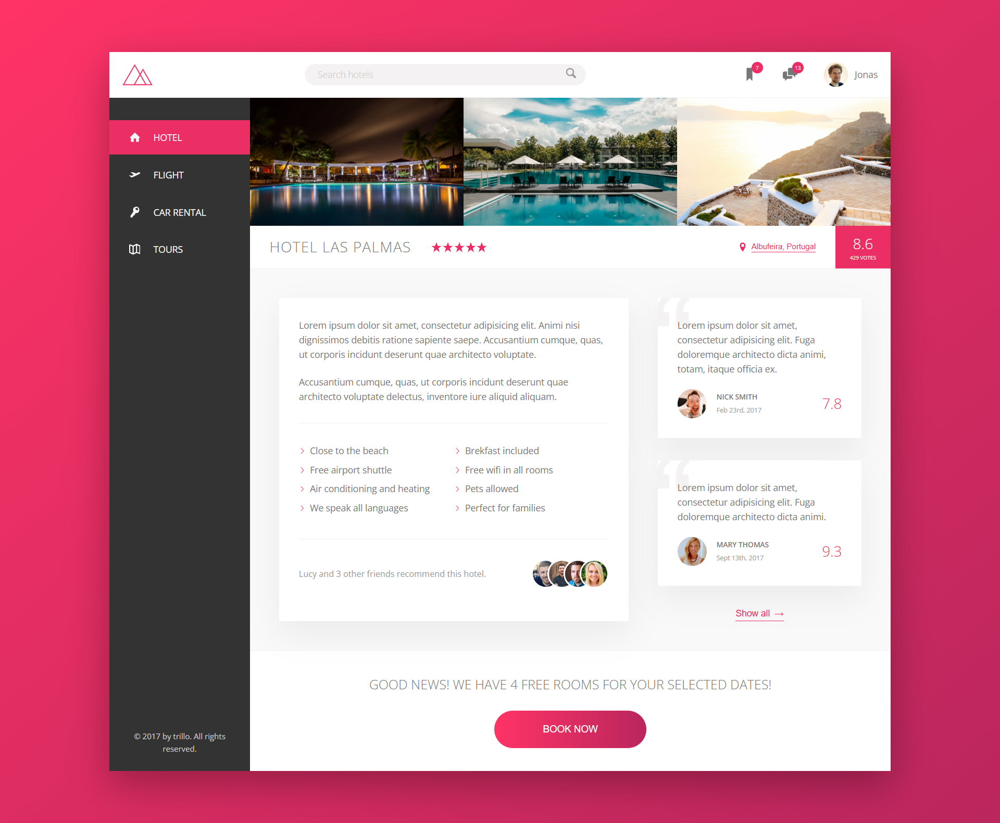

 # 🌍 Trillo — Modern Travel Booking Website

**Trillo** is a modern and fully responsive travel booking website built using **HTML**, **CSS (Flexbox & Grid)**, and **Sass**.  
This project was developed as part of the *Advanced CSS and Sass* course by [Jonas Schmedtmann](https://www.udemy.com/course/advanced-css-and-sass/), focusing on mastering advanced layout techniques and clean UI design.

---

## ✨ Features
- 🌐 Fully responsive one-page layout  
- 💼 Clean and minimal UI for hotels, tours, and flights  
- 🧩 Built with **Flexbox** and **CSS Grid**  
- 🎨 Organized **7–1 Sass architecture**  
- ⚡ Optimized for modern browsers  

---

## 🧠 What I Learned
- Deep understanding of Flexbox and Grid layout systems  
- How to structure large CSS projects using Sass  
- Writing clean, reusable, and scalable CSS code  
- Building a pixel-perfect layout from a design concept  

---

## 🛠️ Tech Stack
- **HTML5**  
- **CSS3 (Flexbox & Grid)**  
- **Sass (SCSS)**  

---

## 🚀 Live Demo
👉 [trillo &mdash; Your all-in-one booking app](https://trillo-nugrah.vercel.app/)

---

## 🖼️ Preview


---

## 🧑‍💻 Author
**Fabianugerah Bainasshiddiq**  
🔗 [GitHub Profile](https://github.com/Fabianugerah)

---

## ⚙️ Installation & Setup

1. **Clone the repository**
   ```bash
   git clone https://github.com/Fabianugerah/Trillo-Project.git
   cd Trillo-Project

